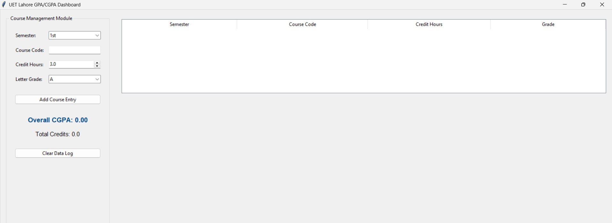

# UET Lahore GPA & CGPA Analysis Tool

A Python-based desktop application designed according to official UET Lahore Engineering Academic Regulations to calculate precise Semester GPA, tracking cumulative CGPA vectors, and mapping visualization trends.

## 📁 Repository Directory Workspace
```text
gpa-calculator/
├── gpa_calculator.py        # Native Terminal application runner logic
├── gpa_calculator_gui.py    # Desktop GUI window interface engine built with Tkinter
├── README.md                # System documentation manuals 
└── requirements.txt         # Code dependency array layer files
```

## 🛠️ Step-by-Step Installation Framework

1. Clone or navigate straight into your local code deployment module environment directory path:
   ```bash
   cd gpa-calculator
   ```
2. Core dependencies engine packages installation:
   ```bash
   pip install -r requirements.txt
   ```
3. Boot the desktop dashboard graphical user interface application wrapper layer:
   ```bash
   python gpa_calculator_gui.py
   ```

## 📊 Application Layout & Execution Strategy
* **Calculations**: Done automatically using underlying `pandas` vectorized formulas.
* **Plots**: Renders structural interactive trend curve coordinate updates via `matplotlib` canvas frames.
* **Transcripts**: Input letter marks match the standard UET 4.00 evaluation matrices.

## GUI Preview


